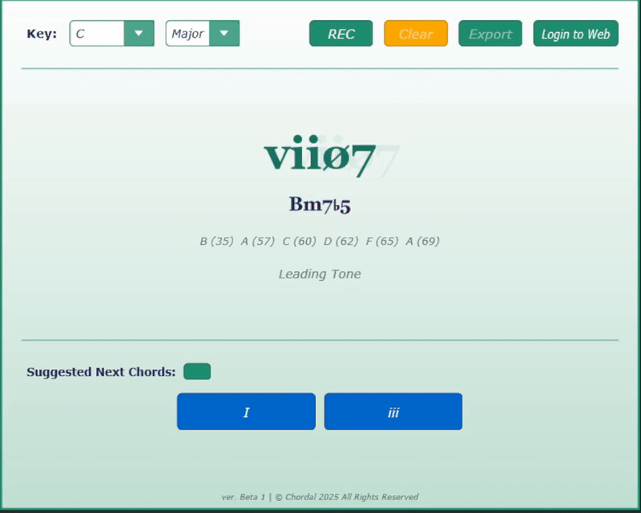

# Chordal VST - Chord Progression Analysis and Suggester

A real-time MIDI chord analysis VST3 plugin that helps musicians understand harmonic relationships and improve compositional workflow.

## Description



Chordal is a music theory educational tool designed to bridge the gap between theoretical knowledge and practical composition. It provides real-time chord analysis, Roman numeral notation, and progression suggestions directly within your DAW.

### Key Features

- **Real-time MIDI Analysis**: Identifies chord structures as you play
- **Roman Numeral Notation**: Displays chords in their functional harmonic context
- **Harmonic Function Display**: Shows the role each chord plays in the key
- **Progression Suggestions**: Recommends theoretically sound next chords
- **Theory Tooltips**: Educational explanations for every chord and concept
- **Chord Recording**: Capture and export your progressions as JSON (To be used in conjuction with the web app)
- **Key Selection**: Display roman numerals in relative major or minor key

## Target Audiences

- Beginner musicians learning music theory
- Intermediate composers expanding their harmonic vocabulary and direct usage in
- Music educators teaching chord progressions
- Anyone interested in understanding the theory behind their compositions

## Technical Stack

### VST Plugin
- **Language**: C++
- **Framework**: JUCE Framework
- **SDK**: VST3 SDK by Steinberg
- **IDE**: Visual Studio 2022 (Windows) / Xcode (macOS) (untested)

### WebApp Platform 
- **Frontend**: HTML5, CSS (Bootstrap), JavaScript (p5.js (for drawing custom graphics and minor animations),  animejs (for smooth animations), Chart.js (charts!) )
- **Backend**:  ASP.NET (C#)
- **Database**: MSSQL (SQL)

## Current Project Structure

```
ChordalVST/
├── Source/
│   ├── ChordAnalyzer.h/cpp      # Core chord identification logic
│   ├── ChordRecorder.h/cpp      # Recording logic
│   ├── ChordTooltips.h/cpp      # Educational content system
│   ├── PluginProcessor.h/cpp    # VST audio processor
│   ├── PluginEditor.h/cpp       # User interface   
├── ChordalVST.jucer
├── README.md
└── etc...

```

## Getting Started

### Prerequisites

- JUCE Framework (v8.0+)
- Visual Studio 2022 (Windows) or Xcode (macOS) (Untested)
- A compatible DAW (FL Studio (Main testing DAW), Ableton, Logic Pro, Cubase, etc.) 

### Building the Plugin

1. Clone the repository:
```bash
git clone https://github.com/Tempura-Ocha/ChordalVST.git
cd ChordalVST
```

2. Open the JUCE Projucer and load the `.jucer` project file

3. Configure your build settings:
   - Set VST3 path for your system
   - Configure IDE export settings

4. Open in your IDE (Visual Studio/Xcode) and build

5. The compiled plugin will be in your builds folder (or VST3 folder following your build settings)

## Usage

1. **Load the Plugin**: Open your DAW and load Chordal as a MIDI instrument
2. **Select Key**: Choose your key and scale using the dropdown menu
3. **Play MIDI**: Play notes on your MIDI keyboard or use your DAW's piano roll
4. **View Analysis**: See real-time chord identification, Roman numerals, and functions
5. **Record Progressions**: Use the REC button to capture your chord progression
6. **Export**: Save your progression as JSON for use in the complementing web abb platform

## (Current) Features

### Chord Analysis
- Identifies major, minor, diminished, augmented triads
- Recognizes 7th chords (maj7, m7, dominant 7, half-diminished, fully diminished)
- Detects suspended chords (sus2, sus4)
- Around 30+ Chord types are implemented

### Theory Integration
- Roman numeral analysis (I, ii, iii, IV, V, vi, vii°)
- Harmonic function labels (Tonic, Subdominant, Dominant, etc.)
- Contextual tooltips explaining each chord's role
- Progression suggestions based on common practices

## VST-WebApp Integration Approach

The system uses a **file-based integration** between the VST plugin and web platform:

1. **VST Plugin**: Exports chord progressions as JSON files
2. **Manual Transfer**: User uploads JSON to web platform
3. **Web Platform**: Parses and stores progressions in SQL database

This approach prioritizes implementation feasibility (because I'm not that good yet) while maintaining core functionality.

## JSON Export Format 

```json
{
  "progressionTitle": "Recorded Progression",
  "keyRoot": 0,
  "isKeyMajor": true,
  "timestamp": "2025-10-24T10:30:00Z",
  "chordalVersion": "1.0.0",
  "chordEvents": [
    {
      "startTime": 0.0,
      "duration": 2.5,
      "chordInfo": {
        "name": "C",
        "notes": [60, 64, 67],
        "rootNote": 0,
        "quality": "", 
        "romanNumeral": "I",
        "function": "Tonic"
      }
    }
  ]
}
```

*quality is unused.

## Roadmap

### Phase 1: Core VST Development 
- [x] MIDI input processing
- [x] Chord detection algorithm
- [x] Roman numeral notation
- [x] Basic UI
- [x] Theory tooltips
- [x] Progression recording
- [x] JSON export

### Phase 2: Web Platform
- [x] User authentication system
- [x] JSON file upload and parsing
- [x] MySQL database integration
- [x] Learning center with theory content
- [x] User progression library
- [x] Token-based login from VST

### Phase 3: Extra Features
- [x] Extended chord recognition
- [x] MIDI export from web platform
- [x] Community sharing features
- [x] Interactive tutorials

##  Contributing

This is a final year project, and isn't intended to be contributed openly and only for two individuals
However, in the future, I'll likely consider revamping this project and make it a publically available repo for contributions.

##  Final Thoughts on the Future of this Project

I would *love* to refactor the logic behind the chord identification because I personally think currently it's a bit naive, and heavy on the if-elses. 
The chord analysis logic is very monolithic, tedious, fragile and very clearly the work of someone who had a vision but sparsely know how to implement what they wanted effectively. Certainly  after awhile it becomes an issue of sunk costs, would I rather finish this project or be in refactor hell. That is the nature of experience after all. Now after completion, I know a few things better now.

Examples of improvements that I'm certain are;
- Seperating the logic into classes with strategy patterns, more modular than what we have currently.
- Would like to move chord patterns into a data file (JSON), allowing non-programmers to contribute! (seperation of logic v. data)
- Some more robust documentation (I just learned of doxygen's existence oops!) (and less magic numbers)
- Implementing the Facade pattern to the God Object ChordAnalyser class to ensure it doesn't just do *everything*
- Use std::string_view, rather than std::string (For vauge performance reasons that may be inconsequential in the grand scheme of performance, however, It seems aproperiate.)

Regardless, if you did discover this project and a musician, and it helped you in any way, I'm happy.
Here's hoping for the future.

## Author(s)

**M. A. Aiman (aka tempOcha)** and **M. L. Joaqhim**

## Acknowledgments

- JUCE Framework
- Hooktheory for the inspiration.

## License

GPL V3.0 

---

**Note**: This project is part of a final year academic requirement. It will be improved and possibly published as a more publicly available and accessible project in the future.
